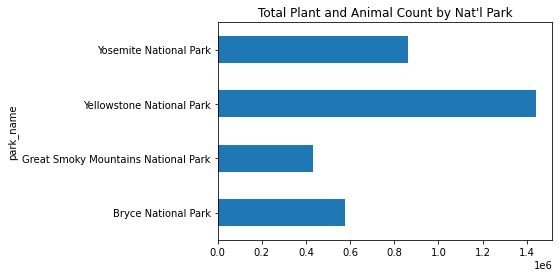
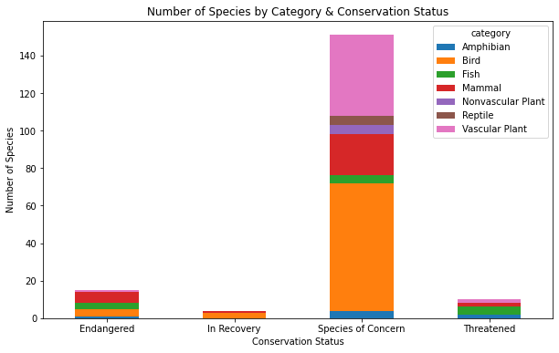

# Analyzing National Park Biodiversity
## A codecademy Career Path Project

**Objective:** Interpret data from the National Parks Service about endangered species in different parks.

Perform data analysis on the conservation statuses of these species and investigate if there are any patterns or themes to the types of species that become endangered. 

Analyze, clean up, and plot data as well as pose questions and seek to answer them in a meaningful way.

Programming languages and libraries used: 
- python
- pandas
- numpy
- matplotlib
- seaborn

It may be easier to view the code by copying/pasting the url for the .ipynb file into [nbviewer](https://nbviewer.jupyter.org/).
